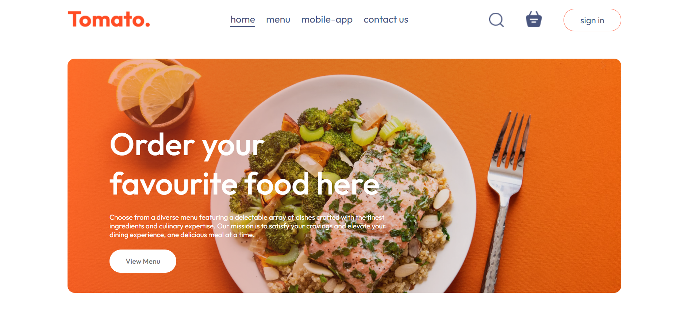
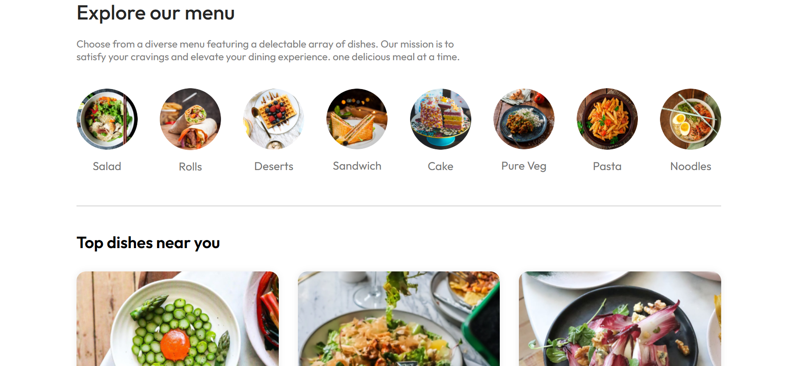
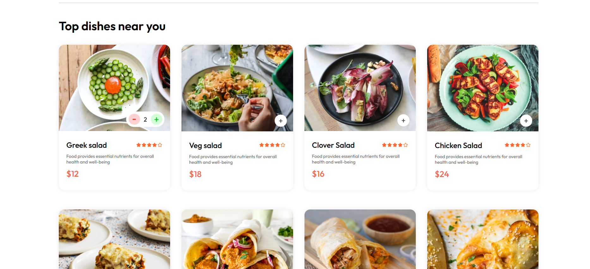
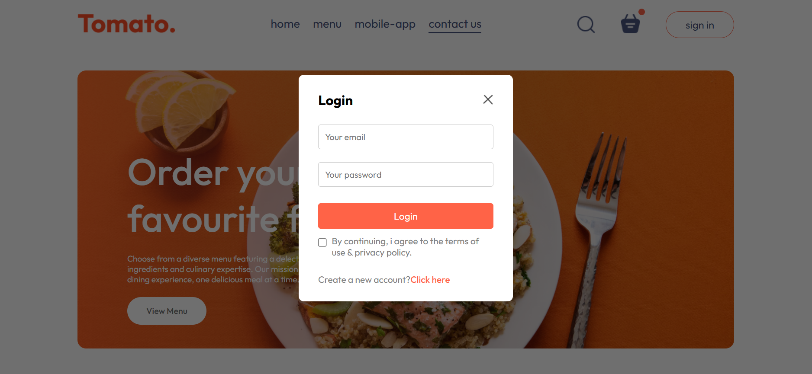
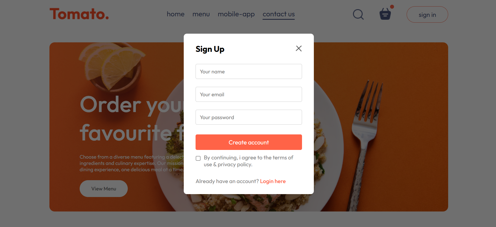
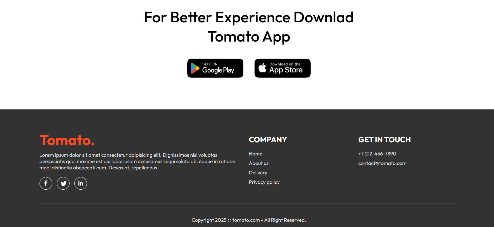

# 🍽️ Food Delivery Web App (React.js)

A responsive Food Delivery web application built using **React.js**. The project displays food items/products with a clean user interface, reusable components, and modern frontend practices.

---

## 🚀 Features

- ✅ Built with **React.js**
- ✅ Functional Components & Hooks (`useState`, `useEffect`)
- ✅ Product / Food item listing UI
- ✅ Responsive design (CSS / Bootstrap)
- ✅ Component-based architecture
- ✅ Ready for API integration

---

## 🛠️ Tech Stack

| Technology | Purpose |
|------------|---------|
| React.js   | Frontend framework |
| JavaScript | Logic & interactivity |
| HTML5      | Structure |
| CSS3 / Bootstrap | Styling / Layout |
| Git & GitHub | Version control |

---

## 🖼 Project Screenshot

#HOME

#MENU

#DISHES

#LOGIN_PAGE

#SIGNUP_PAGE

#CART_PAGE

#DELIVERY_INFORMATION

#FOOTER

